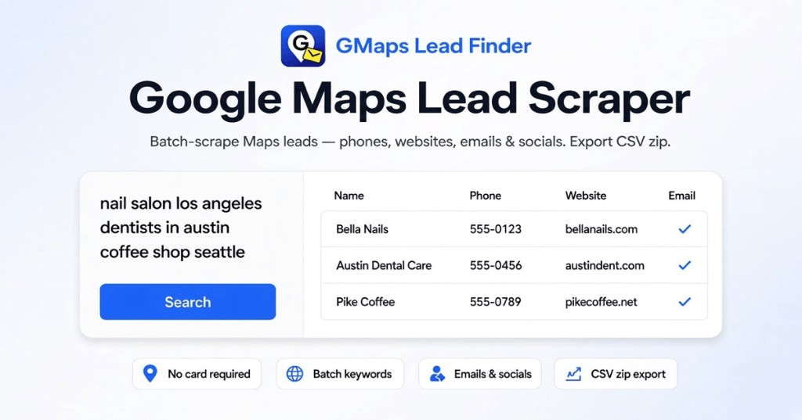

# Google Maps Scraper (GMaps Lead Finder Client)

<p align="center">
  
</p>

[](LICENSE)
[](https://www.npmjs.com/package/@gmapsleadfinder/google-maps-scraper)
[](https://pypi.org/project/google-maps-scraper-sdk/)
[](https://crates.io/crates/google-maps-scraper-sdk)
[](https://pkg.go.dev/github.com/google-maps-lead-scraper/google-maps-scraper/go)
[](https://packagist.org/packages/gmapsleadfinder/google-maps-scraper)
[](https://rubygems.org/gems/google-maps-scraper-sdk)
[](python/)
[](typescript/)
[](go/)
[](rust/)
[](https://github.com/google-maps-lead-scraper/google-maps-scraper-php)
[](ruby/)

Official open-source **Python + TypeScript + Go + Rust + PHP + Ruby** client kit for [GMaps Lead Finder](https://gmapsleadfinder.com) — scrape Google Maps places (name, phone, website, emails, and more) through the hosted Agent HTTP API / Remote MCP.

This repo does **not** run a local browser crawler. It calls the same cloud scrape-and-enrich pipeline as the Online Lead Extractor.

## Get an API key

1. Sign in at [gmapsleadfinder.com](https://gmapsleadfinder.com) (Google OAuth).
2. Use a plan that includes Agent API (**Growth** or higher) — see [Pricing](https://gmapsleadfinder.com/pricing).
3. Open [Account → API key](https://gmapsleadfinder.com/account#api-key), copy your `gmf_…` key.

```bash
export GMF_API_KEY=gmf_your_key_here
```

Full walkthrough: [docs/getting-api-key.md](docs/getting-api-key.md).

## 60-second Quickstart

### Python

```bash
pip install google-maps-scraper-sdk
gmaps-scraper me
gmaps-scraper scrape "dentists in Austin TX" --out leads.json
# or: python -m gmaps_scraper me
```

```python
from gmaps_scraper import Client

client = Client()  # reads GMF_API_KEY
rows = client.scrape("dentists in Austin TX")
print(len(rows), rows[0] if rows else None)
```

### TypeScript / Node

```bash
npm install @gmapsleadfinder/google-maps-scraper
npx gmaps-scraper me
npx gmaps-scraper scrape "dentists in Austin TX" --out leads.json
```

```ts
import { Client } from "@gmapsleadfinder/google-maps-scraper";

const client = new Client(); // reads GMF_API_KEY
const rows = await client.scrape("dentists in Austin TX");
console.log(rows.length, rows[0]);
```

### Go

```bash
go get github.com/google-maps-lead-scraper/google-maps-scraper/go@v0.1.1
```

```go
import gmaps "github.com/google-maps-lead-scraper/google-maps-scraper/go"

client, _ := gmaps.NewClient(nil) // reads GMF_API_KEY
rows, _ := client.Scrape("dentists in Austin TX", nil)
fmt.Println(len(rows), rows[0])
```

```bash
cd go && go run ./cli scrape "dentists in Austin TX" --out leads.json
```

### Rust

```bash
cargo add google-maps-scraper-sdk
# CLI: cargo install google-maps-scraper-sdk --bin gmaps-scraper
```

```rust
use google_maps_scraper_sdk::{Client, ClientOptions};

let client = Client::new(ClientOptions::default())?; // reads GMF_API_KEY
let rows = client.scrape("dentists in Austin TX", Default::default())?;
println!("{} {:?}", rows.len(), rows.first());
```

### PHP

```bash
composer require gmapsleadfinder/google-maps-scraper
vendor/bin/gmaps-scraper me
vendor/bin/gmaps-scraper scrape "dentists in Austin TX" --out leads.json
```

```php
use GmapsLeadFinder\GoogleMapsScraper\Client;

$client = new Client(); // reads GMF_API_KEY
$rows = $client->scrape("dentists in Austin TX");
echo count($rows), "\n";
```

Source: [google-maps-scraper-php](https://github.com/google-maps-lead-scraper/google-maps-scraper-php) (Packagist: `gmapsleadfinder/google-maps-scraper`).

### Ruby

```bash
gem install google-maps-scraper-sdk
# or: bundle add google-maps-scraper-sdk
gmaps-scraper me
gmaps-scraper scrape "dentists in Austin TX" --out leads.json
```

```ruby
require "gmaps_scraper"

client = GmapsScraper::Client.new # reads GMF_API_KEY
rows = client.scrape("dentists in Austin TX")
puts rows.length
```

> Python, npm, Rust, PHP, and Ruby CLIs may all be named `gmaps-scraper`. Prefer `npx` / `python -m gmaps_scraper` / `go run ./cli` / `cargo run --bin gmaps-scraper` / `vendor/bin/gmaps-scraper` / `bundle exec gmaps-scraper` if you install more than one.

## Product & docs links

| Resource | URL |
|----------|-----|
| Website | https://gmapsleadfinder.com |
| Pricing | https://gmapsleadfinder.com/pricing |
| HTTP API docs | https://gmapsleadfinder.com/docs/api |
| Agent & MCP docs | https://gmapsleadfinder.com/docs/agent |
| Agents hub | https://gmapsleadfinder.com/agents |
| OpenAPI | https://gmapsleadfinder.com/openapi-agent.yaml |
| Account / API key | https://gmapsleadfinder.com/account#api-key |
| npm | https://www.npmjs.com/package/@gmapsleadfinder/google-maps-scraper |
| PyPI | https://pypi.org/project/google-maps-scraper-sdk/ |
| Go (pkg.go.dev) | https://pkg.go.dev/github.com/google-maps-lead-scraper/google-maps-scraper/go |
| crates.io | https://crates.io/crates/google-maps-scraper-sdk |
| Packagist (PHP) | https://packagist.org/packages/gmapsleadfinder/google-maps-scraper |
| PHP repo | https://github.com/google-maps-lead-scraper/google-maps-scraper-php |
| RubyGems | https://rubygems.org/gems/google-maps-scraper-sdk |
| Support | support@gmapsleadfinder.com |

Repo docs: [HTTP](docs/http-api.md) · [MCP](docs/mcp.md) · [Python](docs/python.md) · [TypeScript](docs/typescript.md) · [Go](go/README.md) · [Rust](rust/README.md) · [Ruby](ruby/README.md) · [Publishing](docs/publishing.md) · [AGENTS.md](AGENTS.md) · [llms.txt](llms.txt)

## Remote MCP (Claude / Cursor / Codex)

Prefer MCP when using an AI coding agent. Endpoint: `https://gmapsleadfinder.com/mcp`.

**Claude Code**

```bash
claude mcp add --transport http gmaps-finder https://gmapsleadfinder.com/mcp \
  --header "Authorization: Bearer $GMF_API_KEY"
```

**Cursor** (`~/.cursor/mcp.json` fragment)

```json
{
  "mcpServers": {
    "gmaps-finder": {
      "url": "https://gmapsleadfinder.com/mcp",
      "headers": {
        "Authorization": "Bearer gmf_your_key_here"
      }
    }
  }
}
```

MCP tools: `gmaps_me`, `gmaps_create_job`, `gmaps_get_job`, `gmaps_get_results`. Details: [docs/mcp.md](docs/mcp.md).

## Limits (read before batching)

- **Exactly one keyword per API job**
- **One running job per user** at a time (web + API + MCP share the lock) → HTTP `409` if busy
- **1 credit = 1 place row**; enrich is included
- Agent HTTP/MCP requires **Growth+**
- Results page size: `limit` 1–500 (default 100); follow `nextCursor`

## Repository layout

```text
python/          # PyPI: google-maps-scraper-sdk (import gmaps_scraper)
typescript/      # npm: @gmapsleadfinder/google-maps-scraper
go/              # Go module (pkg.go.dev); tag go/vX.Y.Z
rust/            # crates.io: google-maps-scraper-sdk
ruby/            # RubyGems: google-maps-scraper-sdk (require gmaps_scraper)
docs/            # Human guides
openapi/         # OpenAPI snapshot
AGENTS.md        # Instructions for AI agents
llms.txt         # Machine-readable summary

# PHP lives in a separate repo (Packagist root composer.json):
# https://github.com/google-maps-lead-scraper/google-maps-scraper-php
```

## License

MIT — see [LICENSE](LICENSE).
